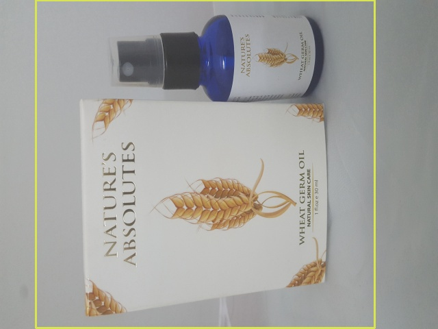
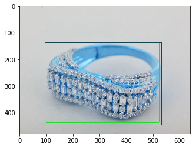

# object-detection-flipkart-hackthon

sample output of images 

- Running `train_frcnn.py` will write weights to disk to an hdf5 file, as well as all the setting of the training run to a `pickle` file. These
settings can then be loaded by `test_frcnn.py` for any testing.

- test.py can be used to perform inference, given pretrained weights and a config file. Specify a path to the folder containing
images:
    `python test.py -p /path/to/test_data/`
- Data augmentation can be applied by specifying `--hf` for horizontal flips, `--vf` for vertical flips and `--rot` for 90 degree rotations

NOTES:
- config.py contains all settings for the train or test run. The default settings match those in the original Faster-RCNN
paper. The anchor box sizes are [128, 256, 512] and the ratios are [1:1, 1:2, 2:1].
- The theano backend by default uses a 7x7 pooling region, instead of 14x14 as in the frcnn paper. This cuts down compiling time slightly.
- The tensorflow backend performs a resize on the pooling region, instead of max pooling. This is much more efficient and has little impact on resultsy

The model is built on top of ResNet50 architecture.

Keras implementation of Faster R-CNN: Towards Real-Time Object Detection with Region Proposal Networks.
implementation inspired from yhenon paper and github.
